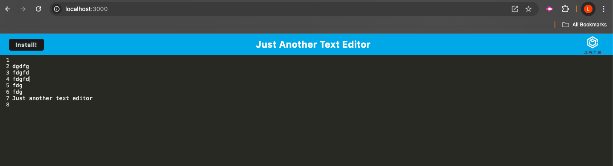
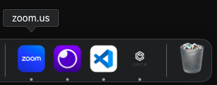

# Text Editor

## Description

My motivation for this project was to learn about progressive web applications. I built this text editor application to gain experience building a PWA. I learned about creating a stand alone app.

## Table of Contents (Optional)

- [Installation](#installation)
- [Usage](#usage)
- [Credits](#credits)

## Installation

The user will run 'npm i' to install the dependencies. The user will cd to the client folder and 'npm run build' to install the dist folder. They will cd to the server folder and run 'node server.js'. The user will go to the browswer and enter URL 'http://localhost:3000/'. They will see the application in the browser and have the choice to install it as a stand alone app on their computer.

## Usage

    
The user may enter text and leave the page, come back to the app, and the text persists. See screenshot image1 for an example of text that has persisted though the browser was closed and reopened days later.

    
The user may install the application onto their local device as a stand alone app.

## Credits

I referred to the class activities and mini project for this unit and past units in order to get examples.